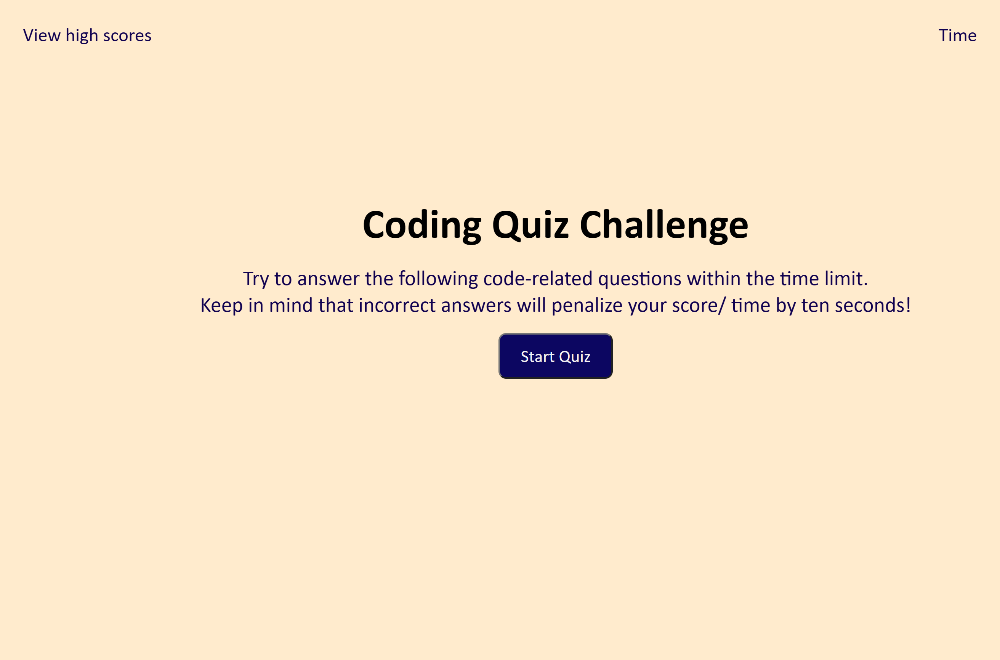

# Javascript-Quiz

## Description

This project was build to create a quiz. The quiz is based on Javascript and anyone can use it to test their knowledge on Javascript. It is time based quiz.

## Installation

N/A

## Usage

This website is a quiz for javascript which anyone can use to test their knowledge. One can click the start button to start the quiz. As soon as quiz starts the timer on the top starts with it. With every correct answer you will get one point and for every incorrect answer 10 seconds will be deducted from the timer. Screenshot of the website is atched below:

## Credits

[WS Schools](https://www.w3schools.com/js/) - I used this to get some clear view on the javascript properties

## License

MIT License

## Link 
[Link for deployed website](https://saloni0412.github.io/Javascript-Quiz/)